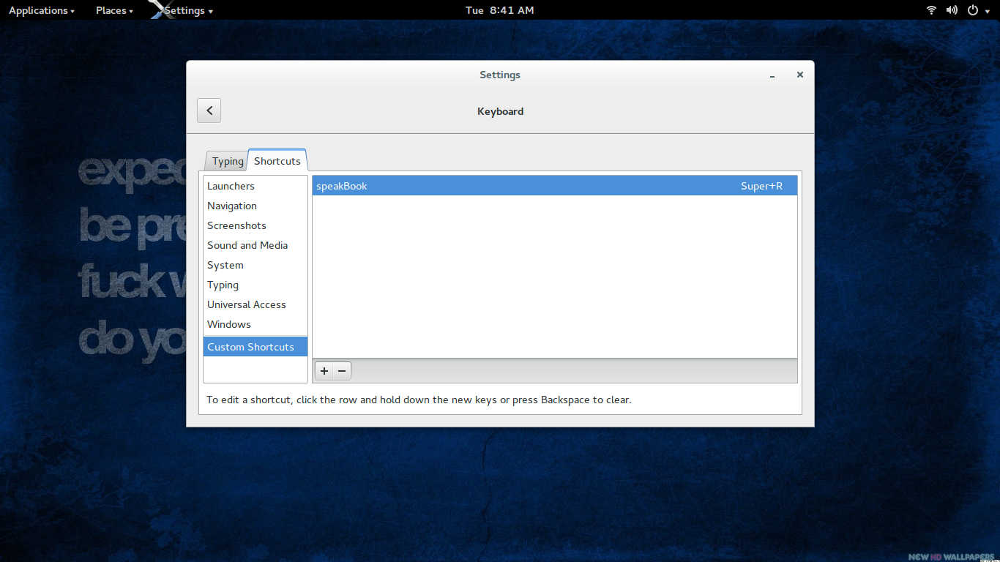

# How to use

Say you come across a long pdf on human psychology like i have here...

  

Highlight on the text you want to be read out loud. Press windows + R key.

  

# Know issues

On some computers shortcut keys must be enabled manually for the program to work

1.On your ubuntu machine click open your setting panel

  

2.Select and open keyboard and navigate to shortcuts tab.

  

3.Go to custom and create a shortcut with the following configuration

name: speakBook
shortcut : super + r
command : bash -c "xsel | espeak"

  

  

